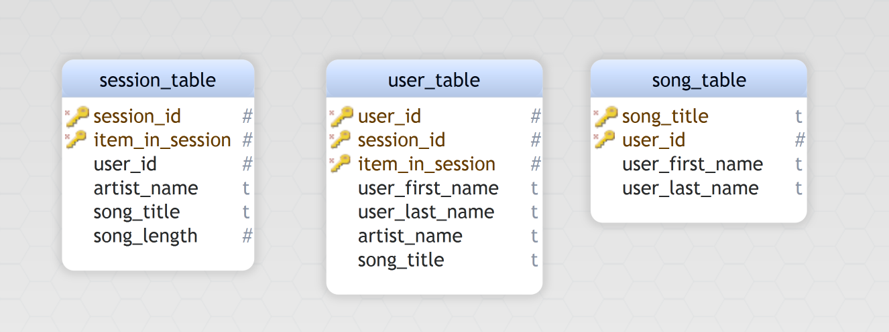

# Data Modeling with Apache Cassandra


### Francisco Salas
  
## Introduction
A startup called Sparkify wants to analyze the data they've been collecting on songs and user activity on their new music streaming app. The analysis team is particularly interested in understanding what songs users are listening to. Currently, there is no easy way to query the data to generate the results, since the data reside in a directory of `CSV` files on user activity on the app.

They'd like a data engineer to create an Apache Cassandra database which can create queries on song play data to answer the questions. The role is to create a database for this analysis. You'll be able to test your database by running queries given to you by the analytics team from Sparkify to create the results.


## Project Overview

In this project, you'll apply what you've learned on data modeling with Apache Cassandra and complete an ETL pipeline using Python. To complete the project, you will need to model your data by creating tables in Apache Cassandra to run queries. You are provided with part of the ETL pipeline that transfers data from a set of CSV files within a directory to create a streamlined CSV file to model and insert data into Apache Cassandra tables.


## Dataset
For this project, you'll be working with one dataset: event_data. The directory of CSV files partitioned by date. Here are examples of filepaths to two files in the dataset:
```bash
event_data/2018-11-08-events.csv
event_data/2018-11-09-events.csv
```
## Schema


## ETL Pipeline
- `CQL_queries.py` contains all the query data for creating keyspace,creating,dropping, inserting and querying tables
- `Project_1B_Project_Template.ipynb` is a jupyter notebook that contains the process of:
  - extracting the data from csv files
  - creating a dataframe
  - create tables
  - extract data from csv files and insert to tables
  - queries for answering questions. 
## Files
- README.md
- event_data
- images
- CQL_queries.py
- event_datafile_new.csv
- Project_1B_Project_Template.ipynb